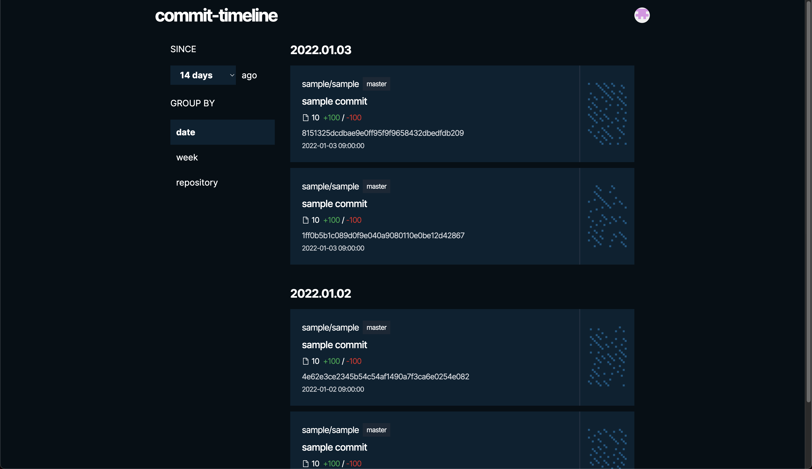

# commit-timeline

GitHub OAuth認証してログインユーザーの直近のコミットの一覧を取得し、日毎や週ごとにまとめて時系列で表示できるアプリケーションです。

リポジトリ/ブランチをまたいでコミットを時系列表示できます。14日前や1ヶ月前などどの期間のコミット一覧を取得するか選択したり、コミットした週やリポジトリ単位でまとめて表示する機能があります。



## 利用手順

```bash
git clone https://github.com/oshima-valuesccg/commit-timeline.git

or

git clone git@github.com:oshima-valuesccg/commit-timeline.git
```

### OAuthクライアント作成

以下の手順でGitHub APIのOAuthクライアントを作成します。

https://docs.github.com/en/developers/apps/building-oauth-apps/creating-an-oauth-app

ローカル環境で動作させる場合は`Authorization callback URL`を`http://localhost:3000/api/auth/authorize`に設定してください。

### 環境変数設定

また`Client ID`と`Client secret`をコピーしてアプリケーションの環境変数に設定する必要があります。`.env.development`ファイルを作成して以下のように設定します。最後の`COOKIE_PASSWORD`は認証用のCookieを暗号化するパスワードです。32文字以上で適当にランダムな文字列を指定してください。

```
GITHUB_CLIENT_ID="xxxxxxxxxxxxxxxxxxxx"
GITHUB_CLIENT_SECRET="xxxxxxxxxxxxxxxxxxxxxxxxxxxxxxxxxxxxxxxx"
GITHUB_REDIRECT_URL="http://localhost:3000/api/auth/authorize"
COOKIE_PASSWORD="xxxxxxxxxxxxxxxxxxxxxxxxxxxxxxxx"
```

環境変数を設定した上で以下のコマンドで起動させます。

```bash
npm run dev
```

`localhost:3000`にアクセスしてGitHubのOAuth認証を行えばコミットの一覧を表示できます。
